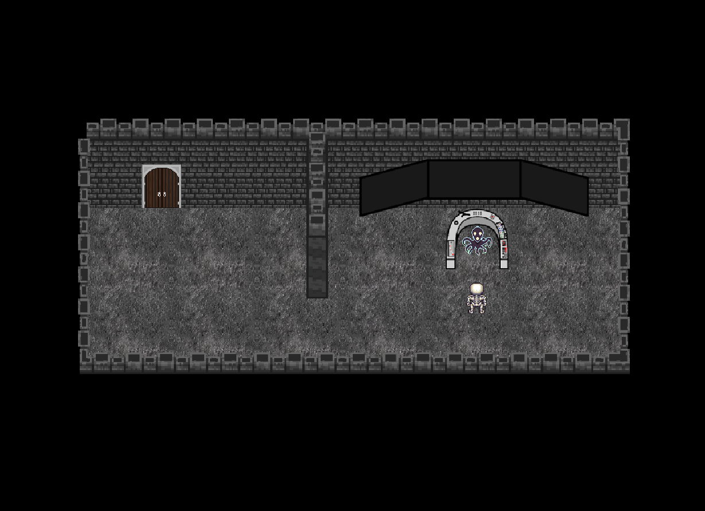

Language: Russian, English

To launch the finished game:

1. Download the packaged game via the [Game App EXE](Game App EXE) path or [download here](Game App EXE/GameAppEXE.zip).

2. Install the "MATLAB Runtime" package for version 9.8 (R2020a) https://www.mathworks.com/products/compiler/matlab-runtime.html .

3. Run the file DungeonTester.exe

To launch the source game:
Allocate more memory to the game! (for a comfortable game) Выделите игре больше памяти! (для комфортной игры)
HOME->Preferences->General->Java heap memory (more than 900mb) (2000 recommend)
To start the game, run the file Main_StartGame.m
All files from the archive must be present in the root of the directory.
Dialogs can be translated into another language Data/Dialogs
The game is optimized for a resolution of 1920x1080, it is not recommended to play if you have a resolution less than 800x600, because if the screen is smaller, the
optimization of dialogs breaks down.

Install the GOST FONT in the Data/Fonts/GOST folder

The game has a Debug mod, which is included in the Game.m file in line 6
is_Debug = 1; % Additional functions for easy debugging
Debug mod allows you to: get coordinates when you click the left mouse button, see hitboxes of collisions and interactions, teleport with the middle mouse button, scale, move the map.

https://www.youtube.com/watch?v=UAM6yYNNrTc

Demonstration of MATLAB capabilities using the example of a game.
Figure, image, rectangle, text interactions, frame by frame animation, code structuring.

You play as a skeleton whose purpose in life is to test the dungeon. Will you be able to overcome all the trials or upset the Architect who gave you a second life? Solve puzzles, complete errands, and maybe you will be given freedom or, in extreme cases, you will be able to escape from here.
When you wake up, you see a creature similar to an octopus, which is waiting for your awakening.
There is emptiness in your head, you do not remember what happened before awakening. Nothing. Look down and see
that something is wrong with your body.
You: - WHAT? Am I a skeleton?
Hmm, why don't I remember ... not the name, not how I got here, not what happened to me
While you were trying to figure out what was happening, your thoughts were interrupted by an octopus.

A: - Greetings mortal!

For entertainment, there are cheat codes:

mega laser power - solves the riddle with a laser

Givemebandana - Gives Forever a Ricardo Milos Bandana

deadteleport - replaces teleport with death teleport

killme - kills the character

alwayskillme - HAAHAHAHAHAHAHAHAHA

debugmode - enables debugging mode (sred.klav.mouse - teleport to the cursor, all collisions are visible)

____________________________________RUSSIAN____________________________________
Для запуска конечной игры:

1. Скачайте игру из директории [Game App EXE](Game App EXE) или [скачайте здесь](Game App EXE/GameAppEXE.zip).

2. Установите пакет "MATLAB Runtime" для версии 9.8 (R2020a) https://www.mathworks.com/products/compiler/matlab-runtime.html .

3. Запустите игру DungeonTester.exe

Для запуска игры из исходного кода:
Для начала игры запустить файл Main_StartGame.m.
В корне каталога должны присутсвовать все файлы из архива.
Игра оптимизирована для разрешения 1920х1080, не рекомендуется играть, если у вас разрешение меньше 800х600, так как если экран меньше, 
то оптимизация диалогов ломается.

Установите ШРИФТ GOST в папке Data/Fonts/GOST/

Так же, просмотрите управление в игре кнопкой "Как играть".
Диалоги можно перевести на другой язык Data/Dialogs

В игре есть Debug мод, который включается в файле Game.m в 6 строке 
is_Debug = 1; % Дополнительные функции для удобной отладки
Debug мод позволяет: получать координаты при клике левой кнопки мыши, видеть хитбоксы коллизий и взаимодействий, телепортироваться средней кнопкой мыши, маштабировать, двигать карту.

https://www.youtube.com/watch?v=UAM6yYNNrTc

Демонстрация возможностей MATLAB на примере игры.
Взаимодействия с figure, image, rectangle, text, покадровая анимация, структурирование кода.

Вы играете за скелета, цель жизни которого это тестирование подземелья. Сможете ли вы преодолеть все испытания или расстроите Архитектора, который дал вам вторую жизнь? Решайте головоломки, выполняйте поручения, и, может быть, вам подарят свободу или, в крайнем случае, удастся сбежать отсюда.
Проснувшись, вы видите некое существо, схожее с осьминогом, который ждет вашего пробуждения.
В голове вашей пустота, вы не помните, что было до пробуждения. Ничего. Опускаете взгляд и видите,
что с вашим телом что-то не так.
Вы: - ЧТОО? Я скелет?
*Хмм, почему я не помню... Не имени, ни как я здесь оказался, ни что со мной случилось*
Пока вы пытались понять, что происходит, ваши раздумья прервал осьминог.

А: -Приветствую тебя смертный!

Для развлечения есть чит коды:

mega laser power - разгадывает загадку с лазером

givemebandana - даёт навсегда бандану рикардо милоса

deadteleport - заменяет телепорт на смерть телепорт

killme - убивает персонажа

alwayskillme - ХААХАХАХХАХАХАХАХА

debugmode - включает режим отладки (сред.клав.мыши - телепорт в курсор, видны все коллизии)
